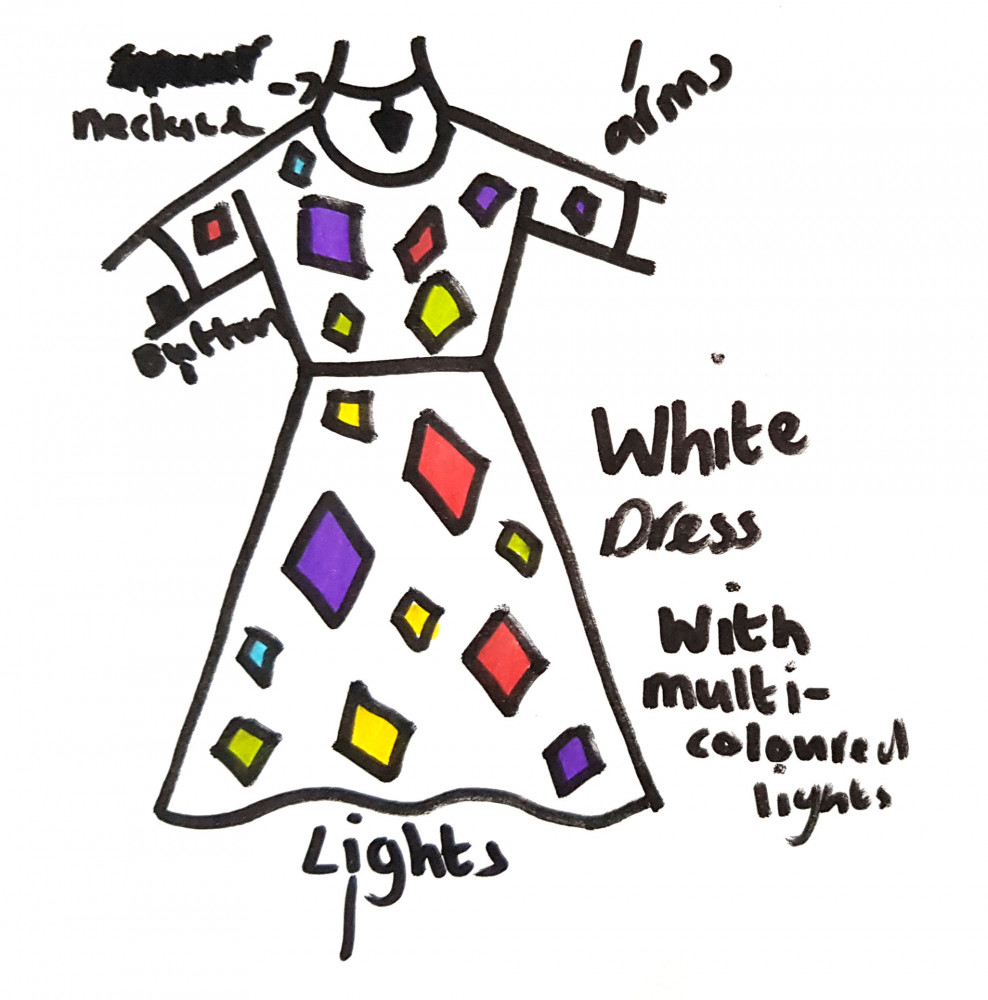

# The Defence Dress

https://www.littleinventors.org/ideas/the-defence-dress/details

36 diamonds, in four colours and three sizes, with different coloured LEDs, that turn on when you press a button on the sleeve. Powered by USB batteries.

## Diamonds

* 3 large red diamonds (16 red LEDs each, for total of 48 LEDs)
* 3 large purple diamonds (16 **blue** LEDs each, for total of 48 LEDs)
* 3 large yellow diamonds (16 yellow LEDs each, for total of 48 LEDs)
* 3 large green diamonds (16 green LEDs each, for total of 48 LEDs)

* 3 medium red diamonds (9 red LEDs each, for total of 27 LEDs)
* 3 medium purple diamonds (9 **blue** LEDs each, for total of 27 LEDs)
* 3 medium yellow diamonds (9 yellow LEDs each, for total of 27 LEDs)
* 3 medium green diamonds (9 green LEDs each, for total of 27 LEDs)

* 3 small red diamonds (4 red LEDs each, for total of 12 LEDs)
* 3 small purple diamonds (4 **blue** LEDs each, for total of 12 LEDs)
* 3 small yellow diamonds (4 yellow LEDs each, for total of 12 LEDs)
* 3 small green diamonds (4 green LEDs each, for total of 12 LEDs)

## Bill of materials

* 87 red LEDs
* 87 blue LEDs
* 87 yellow LEDs
* 87 green LEDs
* Red mirror acrylic
* Purple mirror acrylic
* Yellow mirror acrylic
* Green mirror acrylic
* … And lots more stuff
